This page walks through the visual and statistical results from a few of my ongoing projects.

::: {.panel-tabset}

## Epstein Email Network

For the full modeling code and diagnostics, see the [project write-up](projects.qmd) or get in touch via the Contact page.

### Redaction Detection Pipeline

Before any network could be built, every one of the ~1.4 million released pages had to be run through a fine-tuned Mask R-CNN model to locate redactions, paired with dual OCR engines to recover the surrounding text.

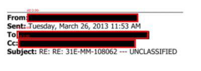{fig-align="center" width="70%"}

<!-- Additional redaction-detection examples and the network-evolution-over-time snapshots go here -->

### The Aggregated Network

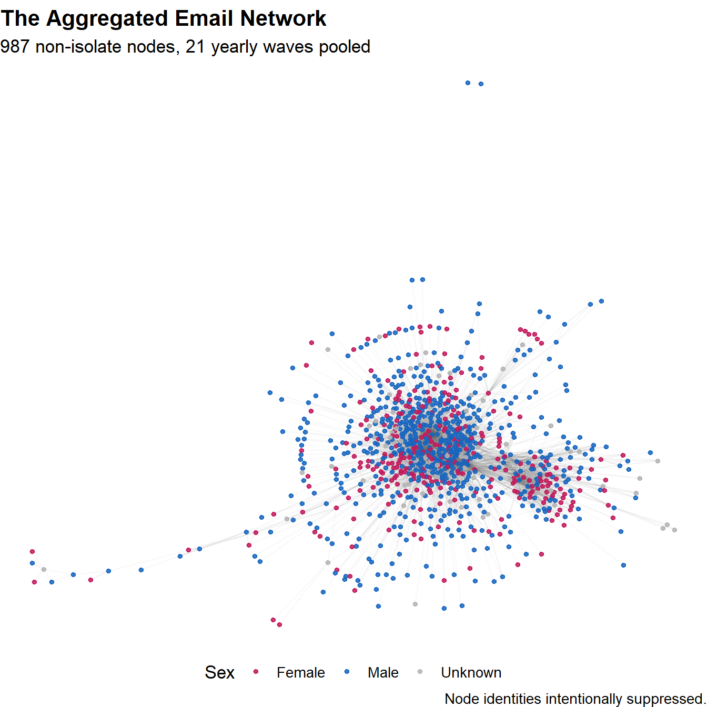{fig-align="center" width="85%"}

The pooled network shows the classic core–periphery shape of an ego-anchored corpus: a dense communicative core surrounded by hundreds of low-degree contacts extending outward in long chains.

### Growth Over Time

::: {layout-ncol=2}
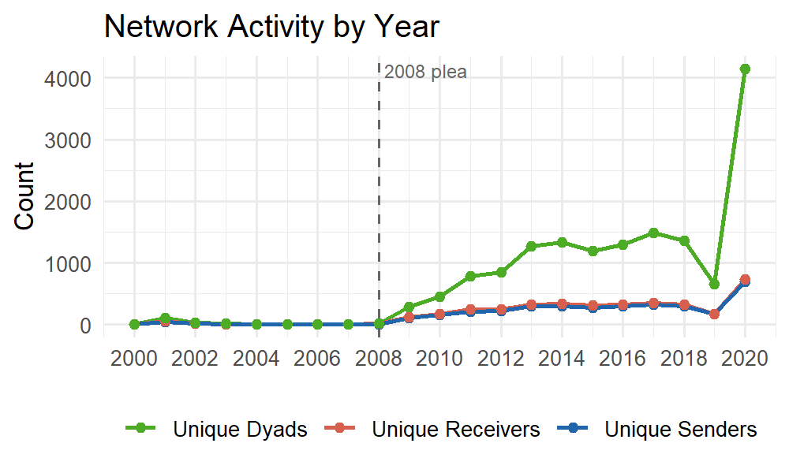{fig-align="center"}

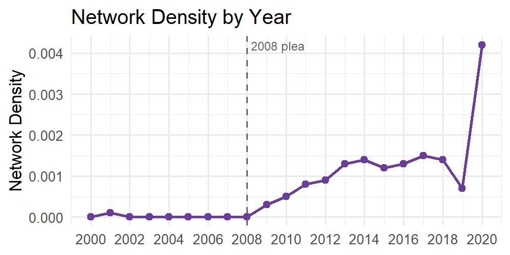{fig-align="center"}
:::

Activity is sparse before Epstein's 2008 plea agreement and climbs steadily afterward, motivating the decision to estimate the final model on the 2009–2019 window rather than the full 2000–2020 panel.

### Who Emails Whom?

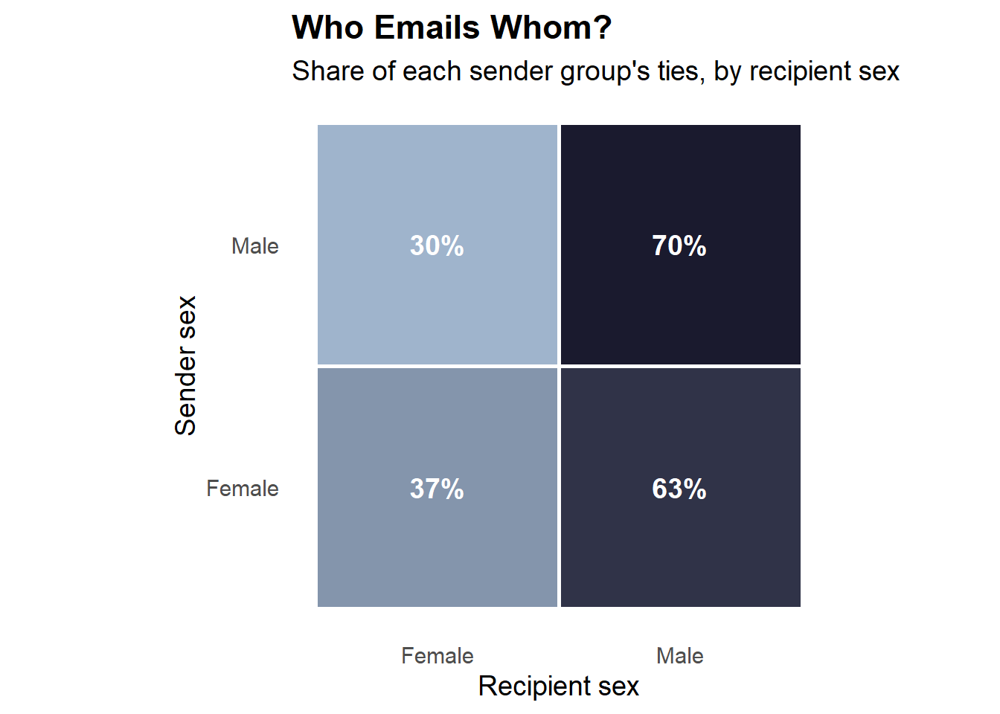{fig-align="center" width="70%"}

A first descriptive look at same-sex clustering: male senders direct 70% of their ties to other men, while female senders direct 63% of theirs to men — women's outgoing ties are noticeably less sex-segregated than men's. This descriptive pattern alone can't separate real homophily from confounds like reciprocity or degree heterogeneity, which is exactly what the temporal ERGM below is built to isolate.

### Temporal ERGM Results

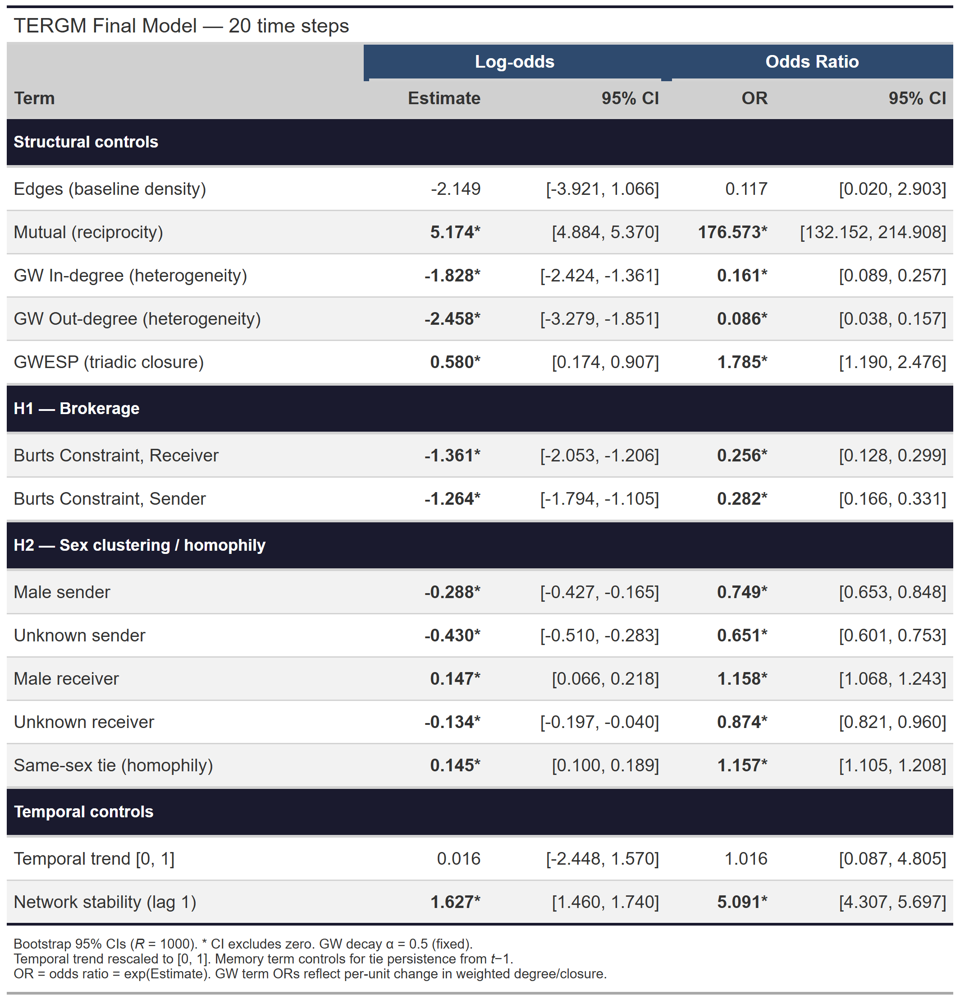{fig-align="center" width="90%"}

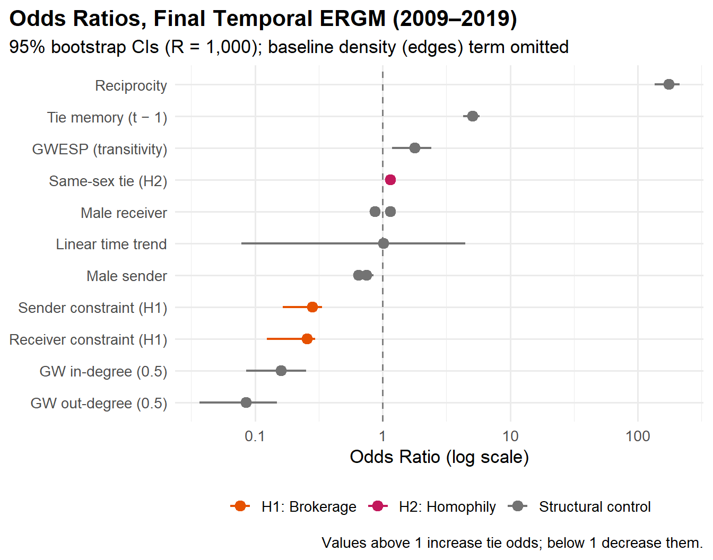{fig-align="center" width="85%"}

Both hypotheses are supported, net of reciprocity, tie persistence, transitivity, and degree distribution:

- **Brokerage (H1):** Low-constraint brokers are significantly more active senders and receivers (Sender constraint OR = 0.28; Receiver constraint OR = 0.26).
- **Homophily (H2):** Same-sex ties are 15.7% more likely to form than mixed-sex ties (OR = 1.16).

The sex main effects reveal an asymmetry beyond the homophily result: male senders are significantly *less* likely to initiate ties (OR = 0.75), while male receivers are significantly *more* likely to receive them (OR = 1.16) — women disproportionately write, men are disproportionately written to.

#### Goodness of Fit

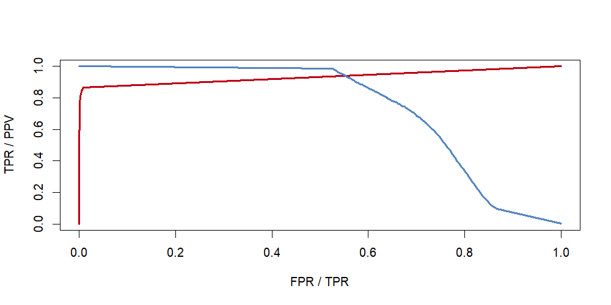{fig-align="center" width="70%"}

Out-of-sample tie prediction is strong, though a substantial share of that performance is carried by the memory (tie-persistence) term — persistence, not novelty, dominates elite email networks.

### Brokerage and Sex

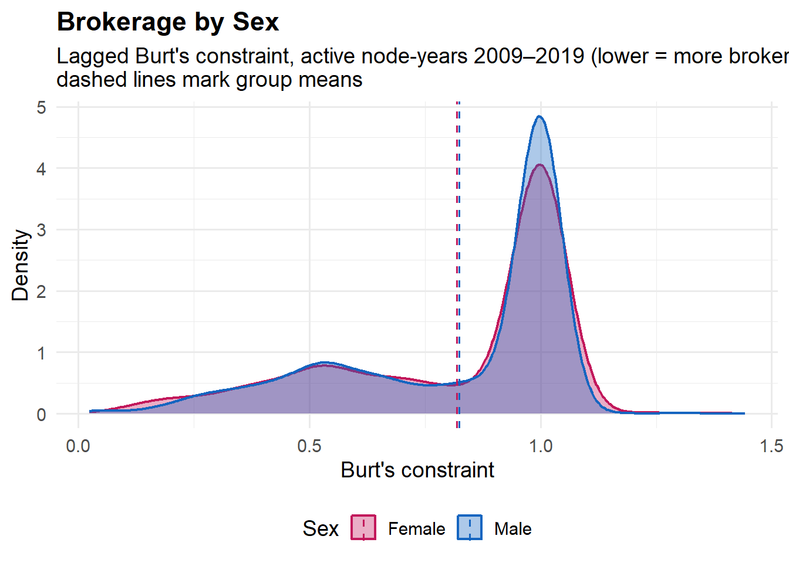{fig-align="center" width="80%"}

The supplementary question behind H1: who actually occupies the brokerage positions the model rewards? Burt's constraint is bimodal — most people cluster near full constraint (1.0, no brokerage opportunity), with a smaller broker-like cluster near 0.5.

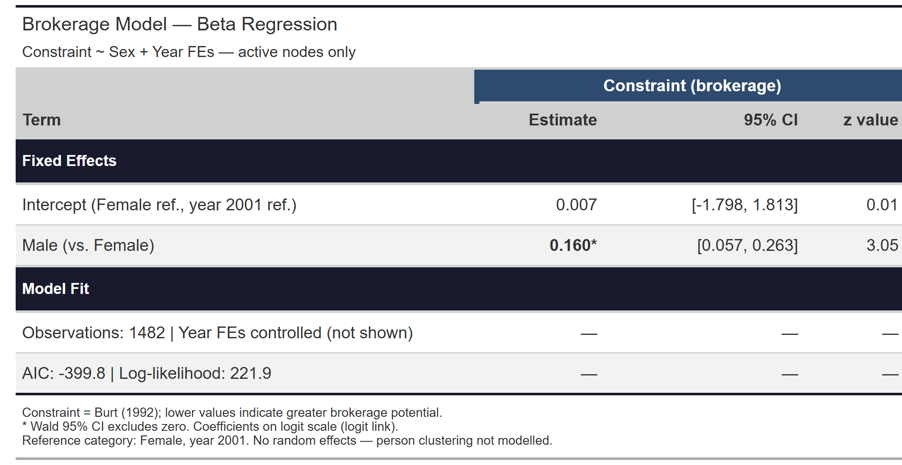{fig-align="center" width="85%"}

Restricting to nodes with actual brokerage opportunity (constraint < 1) and controlling for year fixed effects, the sex gap is statistically significant (β = 0.160, 95% CI [0.057, 0.263], z = 3.05, N = 1,482): women disproportionately occupy the broker-like positions in this network, net of temporal trends.

### Most Active Members

::: {layout-ncol=2}
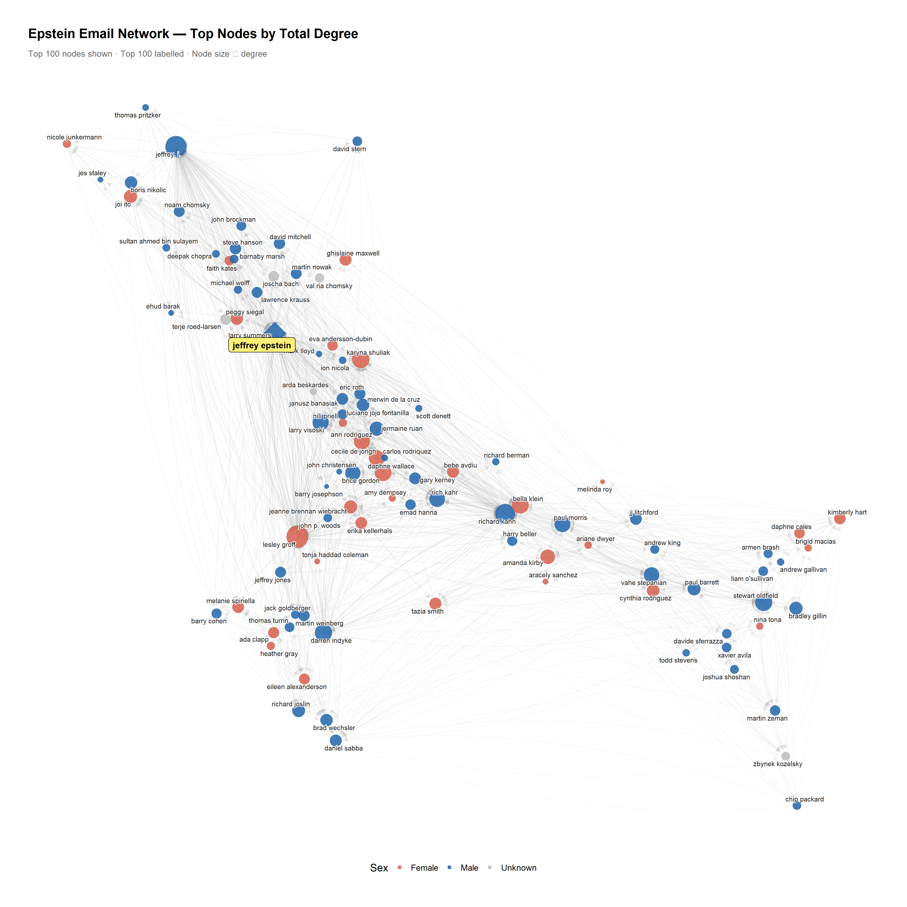{fig-align="center"}

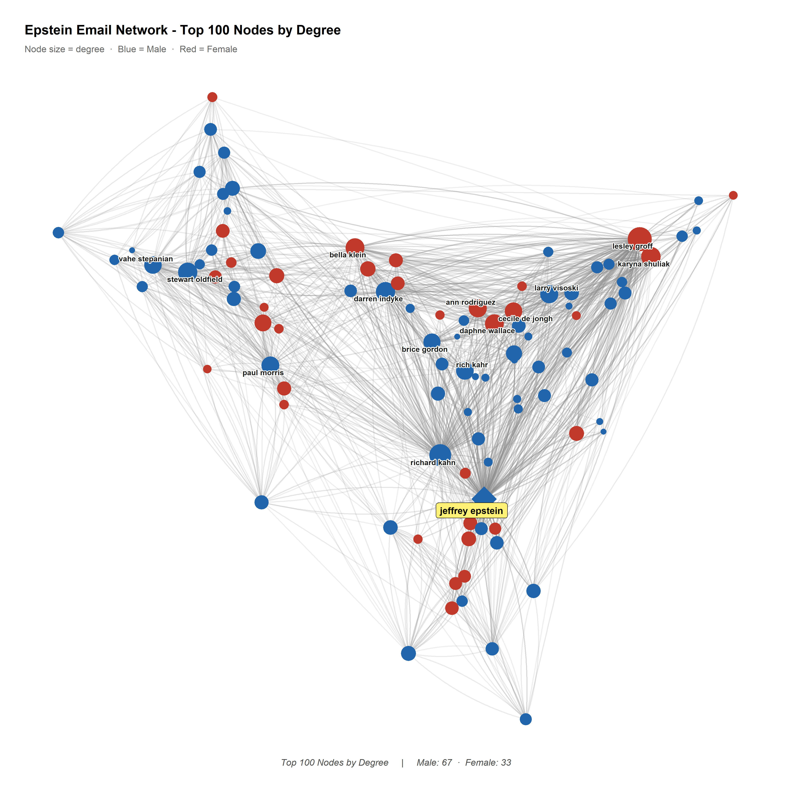{fig-align="center"}
:::

### Interpretation

Existing research on sex trafficking networks identifies a specific advantage women hold within them: an ability to connect with, and gain the trust of, other women. Under patriarchy, women are disproportionately the targets of violence — sexual and otherwise — most often at the hands of men, frequently men they already know. That shared experience of vulnerability creates a baseline of trust between women that trafficking networks can and do exploit. Women recruiting women isn't incidental; it's a structural feature of how these networks operate.

None of this means patriarchy is really about gender. It's about power — who holds it, and who it can be directed against. Gender is simply the axis along which that power most often gets organized and legitimized; the same logic of domination shows up across other hierarchies too.

The results above are consistent with that framing. Women in this network were significantly more likely to initiate contact and occupied a modest but statistically significant brokerage advantage over men — exactly the pattern the trafficking-network literature predicts: women doing more of the connective, trust-dependent work, while remaining structurally subordinate within the network's power hierarchy.

### Time Series Extension

A separate analysis models monthly email volume and redaction density as time series (`auto.arima()`), and disaggregates redaction density by gender dyad and by Epstein's direct involvement.

**Temporal baseline:** the aggregate redaction density series requires a drift term to fit — ARIMA(1,1,1) with drift, confirming a systematic upward trend across 2010–2019. That drift disappears entirely in the subset of emails not directly involving Epstein — ARIMA(0,1,1), no drift — suggesting the upward trend is concentrated in Epstein-involved correspondence rather than being network-wide.

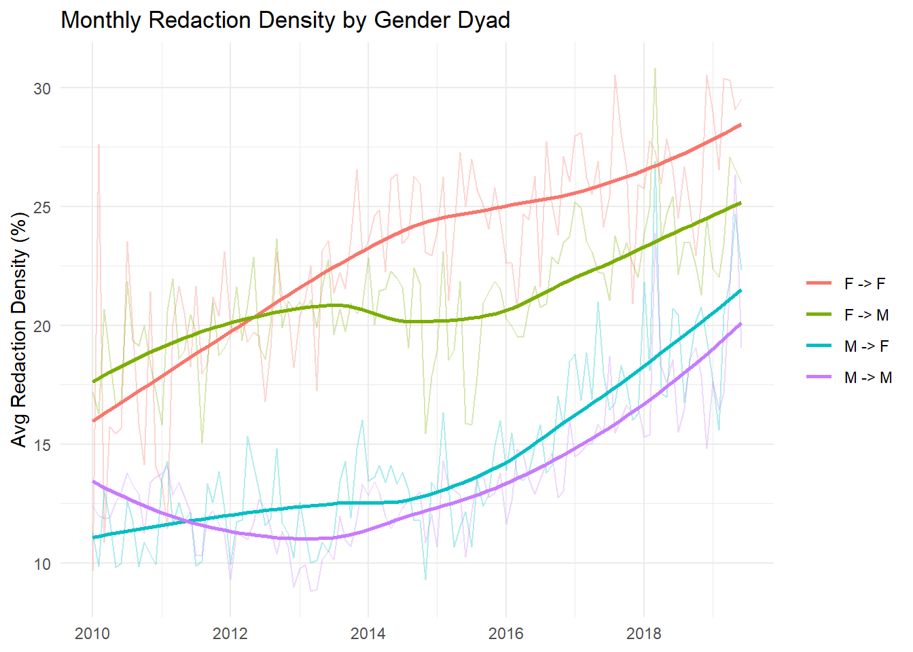{fig-align="center" width="85%"}

**Gender dyad pattern:** redaction density carries a stable ordering across the full period — F→F highest, then F→M, M→F, M→M lowest. This ordering holds across temporal resolutions and the full dataset.

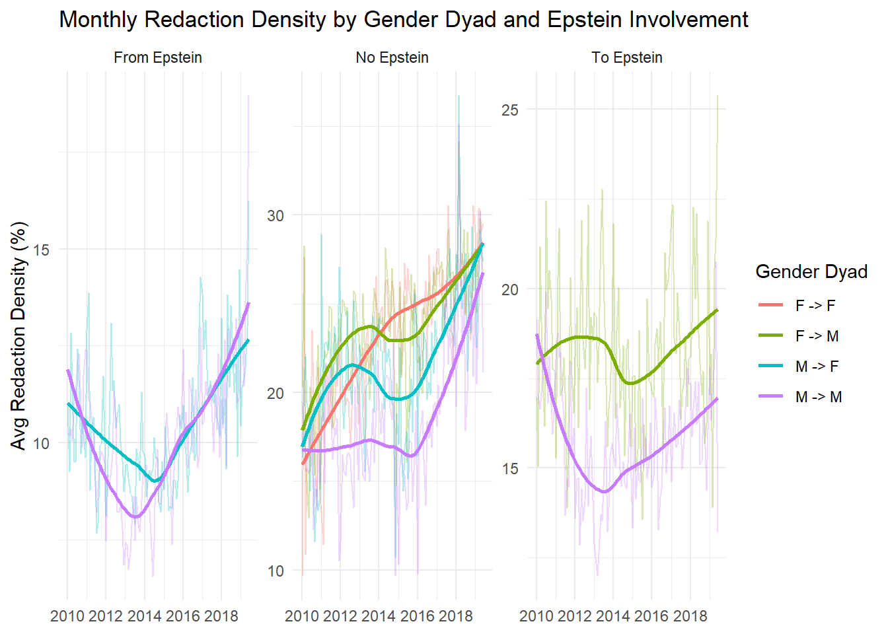{fig-align="center" width="95%"}

Disaggregating by Epstein involvement shows where this pattern actually lives. In the *From Epstein* panel, all four dyads cluster low with no meaningful gender ordering — Epstein's own outgoing emails are uniformly lightly redacted regardless of recipient sex. The *To Epstein* panel shows modest differentiation but no strong trend. The gender effect is concentrated almost entirely in the *No Epstein* panel, where F→F and F→M redaction density rise steadily and diverge from the male-sender dyads — suggesting this is a property of the broader network, not of Epstein's direct correspondence.

Read together with the network results: women were significantly more likely to initiate ties, occupied a significant (if modest) brokerage advantage, and their communications — particularly with other women — were the most heavily redacted in the corpus. Women's roles in this network were both structurally central and disproportionately sensitive.

**Limitations:** gender assignment relied on fuzzy matching and probabilistic inference, and some names were dropped where assignment failed. Redaction density is a proxy — the underlying redaction decisions, legal framework, and any changes to FOIA processing standards over the period aren't observable from the data. The gender dyad and Epstein-involvement breakdowns above are descriptive; no formal interaction model (e.g. mixed effects, interrupted time series) has yet tested these differences directly.

## Political Podcast Text Analysis

<!-- Framing Fingerprint visualizations go here -->

:::
